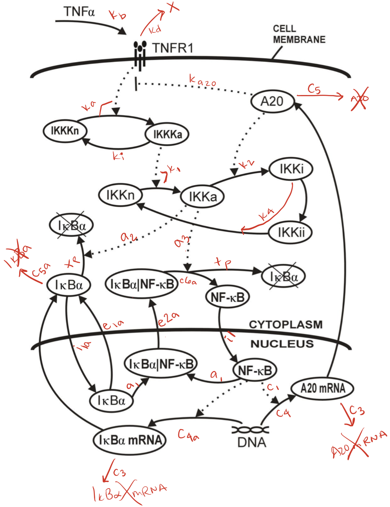
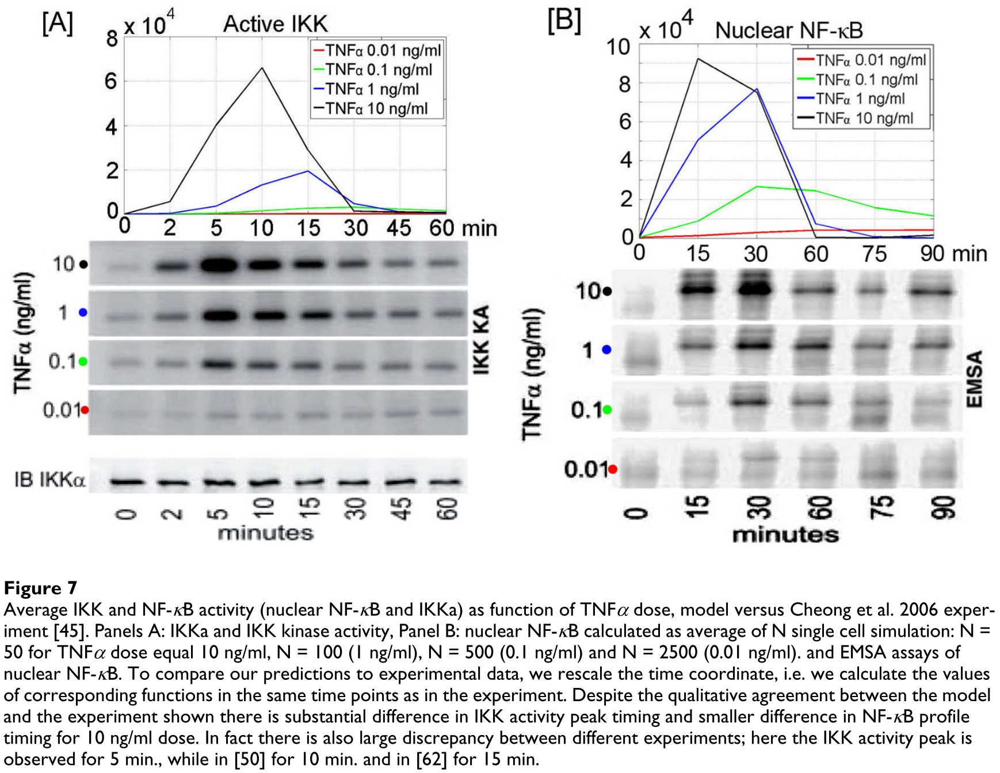
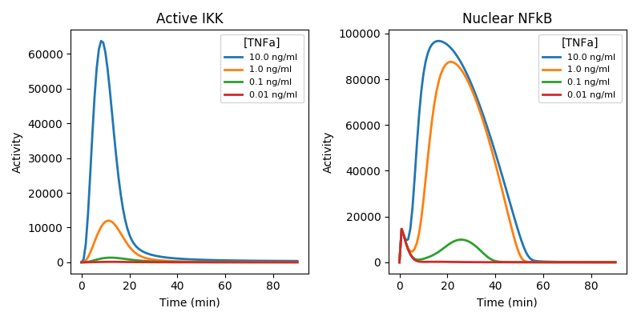

### canb-TNFa-model
Modeling TNFa - NFkB signaling after [Lipniacki, et. al. (2007)](https://bmcbioinformatics.biomedcentral.com/articles/10.1186/1471-2105-8-376#Sec8) using [PySB](https://github.com/LoLab-VU/pysb)  

---
Ensure dependencies are installed in your environment:  
```bash
pip install -r requirements.txt
```
---
##### Markup of model diagram with rate IDs

  

##### Figure from [Lipniacki, et. al. (2007)](https://bmcbioinformatics.biomedcentral.com/articles/10.1186/1471-2105-8-376#Sec8) to reproduce

  
  
##### PySB results
